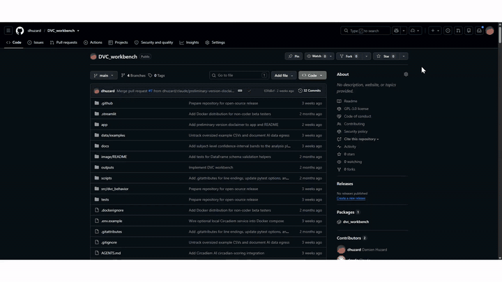

# DVC Behavioral Preprocessing Workbench

[](https://github.com/dhuzard/DVC_workbench/actions/workflows/ci.yml)
[](LICENSE)
[](pyproject.toml)
[](https://github.com/astral-sh/ruff)

A Python + Streamlit workbench for preprocessing binned **Digital Ventilated Cage (DVC)** behavioral data exports, reviewing quality/confounds, and producing traceable outputs for exploratory analysis.

> DVC cages are designed and manufactured by Tecniplast S.p.A.

> ⚠️ **Preliminary version — under active development and not fully validated.** This tool is a work in progress. All results should be independently double-checked before being used for analysis, reporting, or publication. We are actively looking for testers and feedback — please [open an issue](https://github.com/dhuzard/DVC_workbench/issues) to report bugs, problems, or suggestions.

---

## Setup demo for non-coders

A 50-second walkthrough shows how to install Docker Desktop, download the ZIP, launch the workbench, and open the local app.



The animated preview plays on GitHub without sound. For browser controls and audio, open the [MP4 setup video](docs/assets/dvc-workbench-setup-demo.mp4).

---

## Quick start for beta testers (no coding needed)

> Your data **stays on your computer**. The app runs locally in a container — nothing is uploaded to a server.

You only need to do **Step 1 once**. After that, opening the app is two clicks.

### Step 1 — Install Docker Desktop (one-time, ~5 minutes)

Docker is the program that runs the workbench in a sandbox. It's free.

1. Go to <https://www.docker.com/products/docker-desktop/> and download Docker Desktop for your operating system.
   - **Windows:** pick the Windows installer. If asked, choose the **WSL 2** option (the installer will guide you).
   - **macOS:** choose the installer that matches your chip — **Apple Silicon** (M1/M2/M3/M4) or **Intel**. If you're not sure, click the Apple menu → *About This Mac* and check "Chip" or "Processor".
   - **Linux:** install Docker Engine via your package manager (see Docker's docs).
2. Open the installer and accept the defaults.
3. **Start Docker Desktop** (Start menu on Windows, Applications on macOS). Wait until the whale icon in the taskbar/menu bar stops animating — that means Docker is ready.

You do **not** need to create a Docker account to run the app.

### Step 2 — Download the workbench (one-time)

1. On the GitHub page for this project, click the green **`<> Code`** button.
2. Choose **Download ZIP**.
3. **Unzip** the file somewhere easy to find (e.g. your Desktop). You should now have a folder named something like `DVC_workbench-main`.

### Step 3 — Launch the app

Open the unzipped folder, then:

- **Windows:** double-click **`run.bat`**
- **macOS:** in Finder, right-click **`run.sh`** → *Open* (you may have to confirm "Open" once because the script is unsigned). Alternatively, in Terminal: `cd` into the folder and run `./run.sh` (first time only: `chmod +x run.sh`).
- **Linux:** `./run.sh` from a terminal in the folder.

A black/white terminal window will open and show progress.

- **First launch:** the launcher tries to **download a ready-made image** from GitHub Container Registry (typically under a minute on fast internet). If that succeeds, the app starts right away. If the pre-built image isn't available — for example, you're on an internal branch or behind a registry block — the launcher falls back to building the image locally (**5–15 minutes**, lots of scrolling text — that's normal). On Windows, details from the failed pre-built-image pull are saved to a temporary log file before the local build starts.
- **Subsequent launches:** a few seconds.

When you see a line like `You can now view your Streamlit app in your browser` (or just `Uvicorn server started`), open your browser to:

### 👉 <http://localhost:8501>

### Step 4 — Use the app

- The app guides you step-by-step through Import → Metadata → Events → Baseline → QC → Export → Analysis.
- Click **"Load bundled example"** on the Import page to try it without your own data first.
- When you click **Export**, the ZIP downloads through your browser. A copy is also written to the `outputs/` subfolder of the workbench folder.

### Step 5 — Stop the app

In the terminal window where you launched it: press **Ctrl + C** (or just close the window).
To start it again later, repeat Step 3 — you're done with Steps 1 and 2 forever.

---

### Troubleshooting

| Symptom | Fix |
|---|---|
| `Docker is not installed` message in the terminal | You skipped Step 1. Install Docker Desktop and start it. |
| `Docker Desktop is installed but not running` | Open Docker Desktop from your Start menu / Applications and wait for the whale icon to stop animating. |
| `Pre-built image not available` | This is not fatal. The launcher will build the image locally instead; leave the terminal open until it finishes. |
| Browser shows "This site can't be reached" at localhost:8501 | The image may still be building. Wait until the terminal says the server has started. |
| Port 8501 is already in use | Another app is using that port. Stop it, or edit `docker-compose.yml` and change `"8501:8501"` to e.g. `"8601:8501"`, then open `http://localhost:8601`. |
| macOS says `"run.sh" cannot be opened because it is from an unidentified developer` | Right-click the file → *Open* → click *Open* in the dialog. Only needed once. |
| The build fails with a network error | Check your internet, then run `run.bat` / `run.sh` again. Docker resumes from where it stopped. |
| Big CSV upload (>200 MB) is rejected | The default cap is 500 MB. For larger files, increase `maxUploadSize` in `.streamlit/config.toml` and re-launch. |

If you hit something else, copy the **last 20 lines** of the terminal output and send them with your bug report — that's almost always enough for the dev to diagnose.

---

### Advanced (skip if Step 3 worked)

Prefer the raw Docker CLI? From the project folder:

```bash
# Fastest — pull the pre-built image from GHCR (multi-arch: amd64 + arm64)
docker compose -f docker-compose.prebuilt.yml pull
docker compose -f docker-compose.prebuilt.yml up

# Or build locally (for developers, or branches without a published image)
docker compose up --build

# Stop
docker compose down
```

The published image lives at `ghcr.io/dhuzard/dvc_workbench:latest`. Every push to `main` triggers a CI workflow that runs a container smoke test (a real example file through the full pipeline) and, on success, publishes a fresh multi-arch image to GHCR.

### For developers

```bash
pip install -e ".[dev]"
streamlit run app/streamlit_app.py
pytest
ruff check .
```

---

## Features

| Workflow step | What it does |
|---------------|--------------|
| Import | Upload DVC metric & event CSVs, or load bundled examples |
| Validate | Detect groups, subjects, timestamps, native bin size, and parse warnings |
| Metadata & Study Design | Edit study, subject, group, treatment schedule, and group assignment metadata |
| Events, Alignment & Exclusions | Preview events, detect cage-change pairs, configure alignment and confound windows |
| Baseline & Aggregation | Configure baseline window, optional group-mean imputation/overrides, and run the pipeline |
| QC Plots | Review raw/aligned plots, baseline quality heatmap, irregular-bin report, and group means with a selectable 95% CI / SEM band |
| Export | Download a ZIP with processed data, config, metadata, reports, and optional analysis outputs |
| Analysis | Generate exploratory circadian (cosinor + rhythmicity test, IS/IV/RA, period), binned, AUC, bout/fragmentation, estimation-first statistics, and plain-language insight summaries |

---

## Expected input formats

### DVC metric CSV (wide format)

```
day,hour,minute,relativeTime,
{group}_TIMESTAMP,{group}_AVG,{group}_SEM,{group}_QRT,{group}_SAMPLES,
{group}_{subject_1},{group}_{subject_2},...
```

Multiple group blocks can appear in the same file.

**Examples from `data/examples/`:**

| File | Groups |
|------|--------|
| `PartnerC_cohort1_animal_loc_index_smoothed.csv` | `70Q_WT` |
| `cohort2_animal_loc__index_smoothed.csv` | `C57` |
| `E_animal_loc__index_smoothed.csv` | `3_S_C`, `5_S_C` |

### DVC event CSV

```
group,day,hour,minute,relativeTime,timestamp,cage,rack,position,event
```

Known event values: `REMOVED`, `INSERTED`, `CAGE_OFFLINE`, `CAGE_ONLINE`.

---

## Output ZIP contents

| File | Description |
|------|-------------|
| `processed_timeseries.csv` | Full long-format processed data |
| `baseline_summary.csv` | Baseline stats per subject/metric |
| `exclusion_log.csv` | Per-event exclusion windows and row counts |
| `event_table_clean.csv` | Parsed event table |
| `subject_metadata.csv` | Subject-level metadata |
| `group_metadata.csv` | Group-level metadata with scientific labels |
| `study_metadata.yaml` | Study-level metadata |
| `event_metadata.csv` | Manually entered events (header only if unused) |
| `treatment_schedule.csv` | Editable treatment/dosing schedule, when provided |
| `facility_events.csv` | Facility-level confound calendar, when provided |
| `daily_means.csv` | Group mean ± SEM by selected analysis time bin |
| `circadian_summary.csv` | Cosinor MESOR, amplitude, acrophase, R2, phase, plus a zero-amplitude rhythmicity p-value and amplitude/acrophase confidence intervals |
| `nonparametric_circadian.csv` | Distribution-free IS, IV, RA, M10, and L5 per subject |
| `period_estimate.csv` | Per-subject Lomb–Scargle dominant period (free-running / tau designs) |
| `activity_bouts.csv` | Per-subject active/inactive bout counts, durations, and fraction time active |
| `light_dark_summary.csv` | Light/dark group summaries and dark/light ratio |
| `quality_report.csv` | Per-subject/metric quality diagnostics |
| `auc_summary.csv` | Per-animal trapezoidal AUC values for the selected window |
| `stats_summary.csv` | Estimation-first comparisons: median difference + bootstrap CI, effect sizes + CI, exploratory p/FDR q-values, small-sample warnings, and statistical notes |
| `circadiem_scores.csv` | AI circadian marker scores (0–3) per group from the optional Circadiem service, keyed by `run_id` + label; per-image failures kept as `status=error` rows (only present if you run AI scoring) |
| `analysis_config.yaml` | All parameters used for this run |
| `manifest.yaml` | Input file hashes, row counts, selected config, and app version |
| `processing_report.md` | Human-readable run summary |
| `metadata_validation_report.md` | Metadata quality summary |
| `insights/narrative.md` | Grounded plain-language interpretation of the summary tables (offline by default) + draft Methods paragraph |
| `insights/payload.json` | The exact aggregated payload the narrative was generated from (traceability; no raw time series) |

---

## Project structure

```
dvc-behavioral-preprocessing-workbench/
├── app/
│   ├── streamlit_app.py          # guided Streamlit GUI
│   └── components/               # workflow and metadata editor components
├── src/
│   └── dvc_behavior/
│       ├── config.py             # Constants & defaults
│       ├── io.py                 # File I/O utilities
│       ├── parsing.py            # Wide→long DVC CSV parser
│       ├── metadata.py           # Subject/group metadata
│       ├── events.py             # Event CSV parser
│       ├── light_dark.py         # ZT & light/dark annotation
│       ├── exclusions.py         # Exclusion window logic
│       ├── alignment.py          # Temporal alignment
│       ├── baseline.py           # Baseline calculation
│       ├── aggregation.py        # Optional coarser binning
│       ├── analysis.py           # Exploratory analysis helpers
│       ├── insights.py           # Grounded, offline-first LLM insights & Q&A
│       ├── circadiem.py          # Optional Circadiem AI circadian-scoring client
│       ├── literature.py         # Optional Europe PMC literature grounding
│       ├── api_adapter.py        # Future direct DVC API placeholder
│       ├── qc.py                 # Plotly QC figures
│       ├── export.py             # ZIP export builder
│       ├── schemas.py            # Optional warn-only dataframe validation
│       └── reporting.py          # Markdown report generator
├── tests/                        # pytest test suite
├── data/
│   └── examples/                 # Bundled example CSVs
├── outputs/                      # Local export directory
└── pyproject.toml
```

---

## Scientific assumptions

- **Binned exports only.** This app processes pre-binned DVC CSV exports. It does not connect to any DVC API or database.
- **Timestamp is source of truth.** The `{group}_TIMESTAMP` column is used for all time-based operations. `relativeTime` is stored but not used for alignment.
- **subject_id may be a cage label,** not necessarily a biological animal ID. Keep both `subject_id` (detected) and `animal_id` (user-defined) separate.
- **Baseline is per subject and per metric.** Group-level baselines are not computed; group means are derived from individual subjects.
- **Exclusions are traceable.** Every excluded row carries its reason in `exclusion_reason`. Excluded rows are retained in the output with `is_excluded=True`.
- **Exploratory statistics only.** P-values and group comparisons in the app are orientation tools, not confirmatory inference. Statistics are estimation-first: read the effect/difference with its confidence interval and the sample sizes before any p-value, and heed the `small_n_warning` flag (when groups are too small for the test to ever reach significance).
- **Light/dark annotation uses local time.** The user selects a timezone (default: `Europe/Paris`). ZT0 = lights-on time. The cosinor phase split honours the configured photoperiod (not a fixed 12:12).
- **Near-zero baselines are guarded.** Percent-change is not computed when the baseline magnitude is below a small floor; affected rows are flagged via `baseline_percent_change_unstable` so low-activity (e.g. light-phase) baselines cannot inflate group means.
- **Group-plot error bands are subject-level.** The circadian and group-mean plots default to a Student's t **95% CI** computed over per-subject means (selectable: 95% CI / SEM / none), so the band reflects between-animal variability rather than raw-bin count. Time bins with fewer than three subjects are drawn with hollow/open markers because the interval is unreliable there.
- **Imputed baselines are flagged.** Group-mean baseline imputation is optional and sets `baseline_imputed=True`.
- **AI insights are grounded and local-first.** The optional plain-language narrative interprets only the small aggregated summary tables — never your raw time series — and runs fully offline by default (no network, no API key). A local model (Ollama) or a bring-your-own-key cloud model (Anthropic Claude) can be used as an opt-in enhancement; when chosen, only the summary tables are sent. Every narrative records the model and a hash of its input payload for traceability, and always carries the exploratory disclaimer.

---

## AI insights (optional)

The **Analysis** page can turn the summary tables into readable, caveated prose and
answer questions about your data. This layer is designed around the same
local-first promise as the rest of the workbench.

**Data egress at a glance.** Everything is **offline by default** — the table below is
the complete list of optional features that can talk to the network, and each is
**opt-in and off until you turn it on**. The model never sees your raw time series.

| Feature | Default | What can leave your machine | Where it goes | Credential |
|---------|---------|-----------------------------|---------------|------------|
| Offline narrative | **On** | Nothing | — | None |
| Ollama narrative / Q&A | Off | Aggregated summary tables only | Your **local** Ollama server | None |
| Anthropic Claude narrative / Q&A | Off | Aggregated summary tables only | Anthropic API | Your `ANTHROPIC_API_KEY` (BYO) |
| Europe PMC literature | Off | Generic topic **keywords** only (never data/group/file names) | Europe PMC API | None |
| Circadiem circadian scoring | Off | A **rendered plot image** per group (no raw series) | A Circadiem service **you** deploy → OpenAI | `OPENAI_API_KEY`, forwarded per-request, never stored |

> The Circadiem path is the heaviest disclosure: it transmits derived **plot images**
> and forwards an `OPENAI_API_KEY` to a third-party service you operate, which in turn
> calls OpenAI. Running Circadiem locally keeps the *service* local, but the OpenAI
> vision call still egresses from it. See the [Circadiem](#ai-insights-optional) details
> below before enabling it.

**Plain-language narrative.** Pick an *Insight engine*:

| Engine | What leaves your computer | Needs |
|--------|---------------------------|-------|
| **Offline** (default) | Nothing — a deterministic template runs locally | Nothing |
| **Local model via Ollama** | Only the aggregated summary tables, to your local Ollama server | A running [Ollama](https://ollama.com) + a model |
| **Anthropic Claude** | Only the aggregated summary tables, to Anthropic's API | An API key + a Claude model id |

The offline narrative renders immediately and is always the version written to the
export bundle. Model engines run only when you click **Generate**, after an explicit
note of exactly what is sent. Results show the model id, token usage, and the payload
hash for traceability.

**Ask a question (grounded Q&A).** With a tool-capable model selected (Anthropic
Claude), the **Ask a question about your data** panel answers by *calling the real
analysis functions on your processed data and interpreting the returned tables* — it
never fabricates numbers. The answer lists which analysis tools it ran for full
transparency.

**Key / model configuration.** No model id is hardcoded. Paste the Claude model id of
your choice in the UI, and set the key in the field or via the `ANTHROPIC_API_KEY`
environment variable. The optional `anthropic` / `requests` packages are imported lazily,
so the offline path needs neither.

> **Recommended starting model:** **Claude Haiku 4.5** (`claude-haiku-4-5-20251001`) —
> fast and inexpensive, and since the payloads are just small summary tables it produces
> a solid narrative. Step up to **Claude Sonnet 4.6** (`claude-sonnet-4-6`) for richer
> synthesis, or a **Claude Opus** model for the most detailed multi-table reasoning and
> the grounded Q&A. (Use the latest available version of whichever tier you pick.)

**Related literature (optional).** The insights panel can search
[Europe PMC](https://europepmc.org) for work related to your analysis. It is **off by
default**; when you run it, only a few **generic topic keywords** (e.g.
`circadian rhythm locomotor activity rodent`) derived from the *kinds* of results are
sent — never your data, group names, or file names. The exact queries are shown before
you search, and results are framed as suggestions to verify, not as evidence. Needs the
`requests` package (already a dependency) and network access.

The export ZIP always contains `insights/narrative.md` (offline narrative + draft
Methods paragraph) and `insights/payload.json` (the exact aggregated input, for audit).
If you fetched references, it also includes `insights/literature.md` and
`insights/literature.json`.

**AI circadian scoring (Circadiem, optional).** The Analysis page can also send the
group activity curves to **[Circadiem](https://github.com/dhuzard/dvc_workbench)**, a
separate, stateless scoring service that grades six circadian markers on a fixed 0–3
rubric using an OpenAI vision model. It is **off until you configure a service URL**.

- *What leaves your computer:* only a **rendered plot image** (one global mean curve
  per group), never your raw time series. The workbench draws the plot in the exact
  convention the rubric assumes — **dark onset at x=0, a black global mean (VCG) curve,
  and a ±2 SD band** — so the scores are meaningful.
- *Service & key:* point the workbench at a deployed Circadiem instance via the
  `CIRCADIEM_BASE_URL` environment variable (or the field in the UI). The workbench
  forwards a **server-side `OPENAI_API_KEY`** (set in the host environment) to Circadiem
  as a per-request bearer token; neither the workbench nor Circadiem stores it.
- *Results:* the six markers (`baseline_light`, `dark_onset_burst`, `dark_irregularity`,
  `midnight_fragmentation`, `pre_light_decline`, `pre_dark_anticipation`), a confidence
  level, flags and notes are shown in the UI and written to `circadiem_scores.csv` in the
  export, keyed by `run_id` + label. Per-image failures are kept as `status=error` rows
  rather than silently dropped. Scoring needs the optional `kaleido` (PNG rendering) and
  `requests` packages, imported lazily.

> Circadiem is integrated **service-to-service over HTTP** — deploy it as its own
> container and point the workbench at it. Its logic and UI are intentionally **not**
> vendored into this repo.

*Try it locally with Docker (before deploying anything).* The compose files ship an
optional `circadiem` service behind an opt-in `ai` profile, so the default
`docker compose up` is unchanged:

```bash
cp .env.example .env        # set OPENAI_API_KEY and CIRCADIEM_IMAGE
docker compose --profile ai up      # starts workbench + a local Circadiem
```

The two containers share the compose network, so the workbench reaches Circadiem by
name at `http://circadiem:5174` (already the default `CIRCADIEM_BASE_URL`); no host
ports to juggle, and this is backend-to-backend so no `CORS_ORIGIN` is needed. Plain
`docker compose up` (no `--profile ai`) runs just the workbench, with the AI panel
showing the service as unreachable. The image bundles `requests` + `kaleido` so scoring
works out of the box; set `CIRCADIEM_IMAGE` to wherever Circadiem is published, or point
the compose service at a local checkout with `build:`. (The OpenAI vision call still
egresses from your local Circadiem to OpenAI — running Circadiem locally keeps the
*service* local, not the model.)

---

## Reproducibility

Given the same input files and the same `analysis_config.yaml`, the pipeline produces identical output.

The exported `analysis_config.yaml` captures:
- All uploaded file names
- Timezone and light/dark cycle
- Alignment event type and scope
- Exclusion rules (per event type)
- Baseline window and method
- Aggregation bin size
- App version and processing timestamp

The exported `manifest.yaml` records input file names, sizes, SHA256 hashes,
tracked table row counts, selected configuration, app version, and processing
timestamp.

---

## Development

```bash
# Lint
ruff check .

# Format
ruff format .

# Tests
pytest -v

# Tests with coverage
pytest --tb=short
```

---

## Current roadmap

The v0.2 roadmap in `TODO.md` focuses on:

- Maintaining export provenance and file hashing as the reproducibility anchor
- Expanding reusable data-quality diagnostics as new real-world failure modes appear
- Keeping exploratory statistics clearly labelled with effect sizes and FDR correction
- Strengthening smoke coverage around the app workflow

---

## Contributing

Contributions are welcome! Please read [`CONTRIBUTING.md`](CONTRIBUTING.md) and
[`AGENTS.md`](AGENTS.md) (the codebase conventions) before opening a pull request,
and note our [Code of Conduct](CODE_OF_CONDUCT.md). Found a security or privacy
issue? Please follow [`SECURITY.md`](SECURITY.md) rather than filing a public issue.

## Citation

If you use this workbench in your research, please cite it — see
[`CITATION.cff`](CITATION.cff) or use GitHub's **"Cite this repository"** button.

## License

Released under the **GNU General Public License v3.0 or later** — see
[`LICENSE`](LICENSE).
